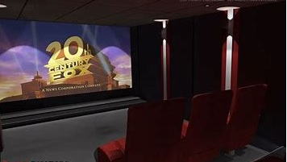
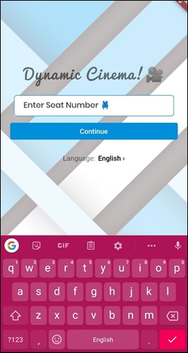
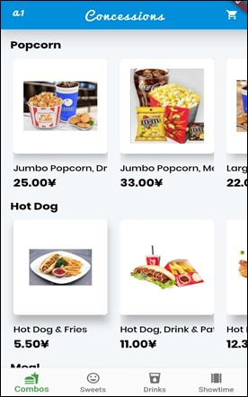
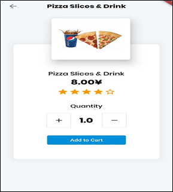
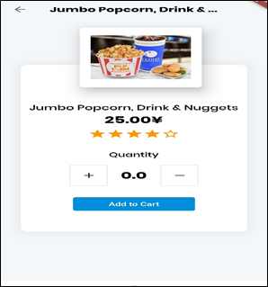
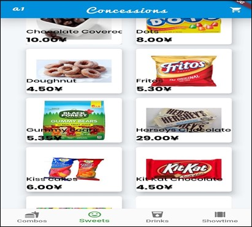
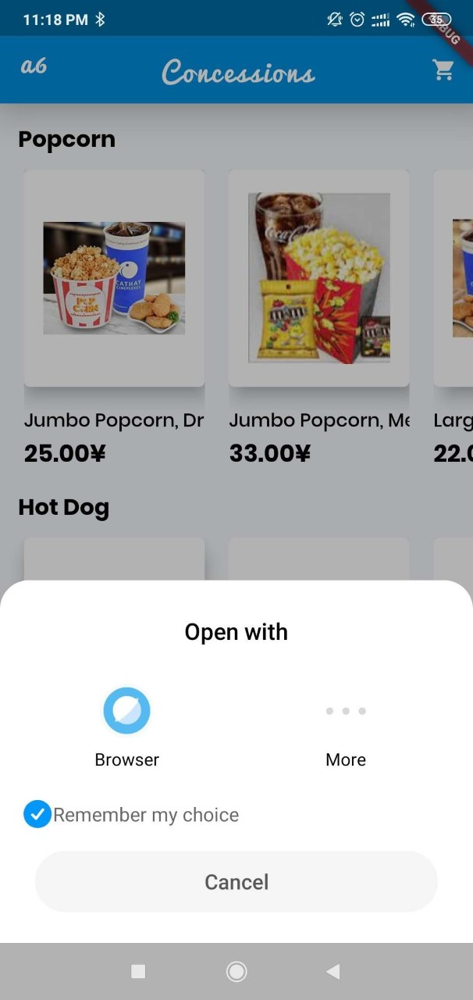

# 🍿🎥😋💺 Dymnamic Cinema - A Concession Ordering Application template kit 

A Flutter User Interface template of a Concession Ordering Application. 

<a href="./app-release.apk"></img></a>

Give a star⭐ to the repo if you like what you see😉.
# 🎥 Demo

# 📸 Screenshots
The following screenshots are taken from an android emulator:

| 1 | 2|
|------|-------|
|||

| 3 | 4|
|------|-------|
|||

| 5 | 6|
|------|-------|
|||

# ✨ Requirements
- Any Operating System (ie. MacOS X, Linux, Windows)
- Any IDE with Flutter SDK installed (i.e. Android Studio, VSCode etc)
- A little knowledge of Dart and Flutter
 
# ☕️ Donate

# Getting Started

This project is a starting point for a Flutter application.

A few resources to get you started if this is your first Flutter project:

- [Lab: Write your first Flutter app](https://flutter.io/docs/get-started/codelab)
- [Cookbook: Useful Flutter samples](https://flutter.io/docs/cookbook)

For help getting started with Flutter, view our 
[online documentation](https://flutter.io/docs), which offers tutorials, 
samples, guidance on mobile development, and a full API reference.

# LICENSE
[MIT](./LICENSE.md)
